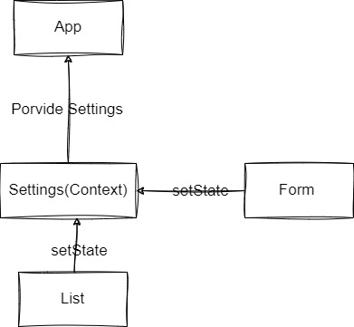

# Todo List
lab: 31 -32  - Context API

Author: **Mohammad Attallah**

Deploy link : [*Deploy todo list*](https://candid-baklava-090d62.netlify.app/)

---

### Description 
Users can add todo tasks and, when they are complete, they can mark them as done

### UML 

### Global State Consumption in Components

Global state in React is typically managed using libraries like Context API or Redux.

Context API: React's Context API allows components to consume global state by providing a centralized way to share data across the component tree. It consists of a Provider component that wraps the application and a Consumer (or useContext hook) that components can use to access the global state provided by the Provider. Components within the tree can consume this global state by connecting to the appropriate Provider.

### useForm Hook

- It initializes a state for form values.
- Handles form submissions, invoking a callback function.
- Updates form state when input values change.
- Sets initial form values with provided defaults.
- Returns an object with functions for form interaction.

This hook simplifies form handling in React components.

